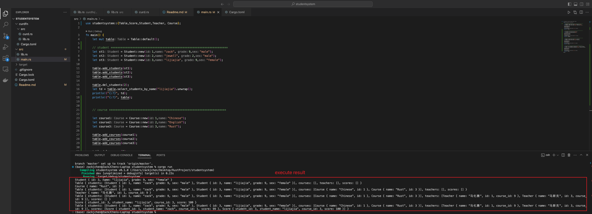

# 学生管理系统
## design
一个struct名为Table，它下面有四个字段，在这里我将每个字段定义成一个talbe，每个element定义一个struct，当成一个table的一个row
每个字段可以实现增删改查功能，并且可以联合查询等等
```rust
struct Table
students :Vec<Student>,
teachers: Vec<Teacher>,
course: Vec<course>,
score: Vec<Score>,
```

## 思考
由于这几个字段都是Vec，且实现的功能都是一样的增删改查，那么将会有很大的代码冗余
所以这里采取derive宏来生成代码

## implement
创建一个CURD macro，用syn转化成DeriveInput，并且构建一个struct保存需要的Field和struct名，
然后遍历Field，获取vec内部的type，动态生成整删改查功能
## Student
实现了增删查功能
> 增删：基于id，
> 查询：基于name，teacher和student表是人名，course表课程名，score表student name


**Test**
```rust
use studentsystem::{Table,Score,Student,Teacher};

fn main() {
    let mut table = Table::default();
    let st1 = Student::new(1,"zack", 9,"male");
    let st2 = Student::new(2,"jewell", 2,"male");
    let st3 = Student::new(3,"lijiajia", 9,"female");

    table.add_students(st1);  // add student
    table.add_students(st2);
    table.add_students(st3);

    table.del_students(2); // delete student
    let td = table.select_students_by_name("lijiajia").unwrap(); // select student
    println!("{:?}", td) // result: Student { id: 3, name: "lijiajia", grade: 9, sex: "female" }
    println!("{:?}", table) // Table { students: [Student { id: 1, name: "zack", grade: 9, sex: "male" }, Student { id: 3, name: "lijiajia", grade: 9, sex: "female" }], courses: [], teachers: [], scores: [] }

}

```

## Teacher
实现了增删查功能
> 增删：基于id，
> 查询：基于name，teacher和student表是人名，course表课程名，score表student name


**Test**
```rust
use studentsystem::{Table,Score,Student,Teacher};

fn main() {
    let mut table = Table::default();

    let t1 = Teacher::new(1,"马化腾", 9);
    let t2 = Teacher::new(2,"马云", 2);
    let t3 = Teacher::new(3,"马斯克", 9);

    table.add_teachers(t1);
    table.add_teachers(t2);
    table.add_teachers(t3);

    table.del_teachers(2);
    let tt = table.select_teachers_by_name("马化腾").unwrap();
    println!("{:?}", tt);
    println!("{:?}", table);
}

```
## Course 
实现了增删查功能
> 增删：基于id，
> 查询：基于name，teacher和student表是人名，course表课程名，score表student name


**Test**
```rust
use studentsystem::{Table,Score,Student,Teacher};

fn main() {
    let mut table = Table::default();
    let course1 = Course::new(1,"Chinese");
    let course2 = Course::new(2,"English");
    let course3 = Course::new(3,"Rust");

    table.add_courses(course1);
    table.add_courses(course2);
    table.add_courses(course3);

    table.del_courses(2);
    let language = table.select_courses_by_name("Rust").unwrap();
    println!("{:?}", language);
    println!("{:?}", table);
}

```
## Score 
实现了增删查功能
> 增删：基于id，
> 查询：基于name，teacher和student表是人名，course表课程名，score表student name


**Test**
```rust
use studentsystem::{Table,Score,Student,Teacher};

fn main() {
    let sc1 = Score::new(1,"zack", 1,99);
    let sc2 = Score::new(2,"jewell", 2,88);
    let sc3 = Score::new(3,"lijiajia", 3,100);

    table.add_scores(sc1);
    table.add_scores(sc2);
    table.add_scores(sc3);

    table.del_scores(2);
    let td = table.select_scores_by_name("lijiajia").unwrap();
    println!("{:?}", td);
    println!("{:?}", table)

}

```

**execute result**


## TODO， 但是之后应该不会做了
1. update功能
2. 联合查询，像查询数据库一样的功能
